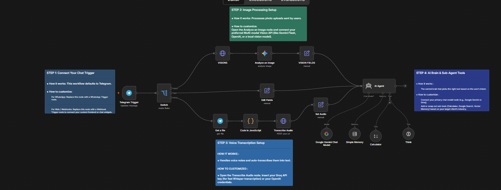

# 🤖 Multimodal Telegram AI Agent Node Workspace for n8n

An enterprise-ready, open-source n8n workflow that routes and processes text, images, and voice data autonomously through advanced AI agents and sub-agent tooling.

## 🚀 Key Features
* **Smart Routing:** Uses conditional switching to automatically handle photos, text strings, and voice recordings.
* **Vision Processing:** Dedicated multi-modal node for analyzing visual data.
* **Audio Transcription:** Smoothly handles audio binaries and converts voice notes to text on the fly.
* **Tool-Equipped Brain:** The central AI Agent is equipped with a Calculator, Google Search, Vector Memory, and deep reasoning tools.

## 🛠️ Step-by-Step Setup Instructions
1. Download the `multimodal-telegram-ai-agent.json` file from this repository.
2. Open your local or cloud n8n canvas, click **Import from File**, and upload the JSON.
3. Follow the color-coded **Sticky Nodes** inside the canvas to connect your Telegram Bot API tokens, Groq/OpenAI/Gemini keys, and tool credentials.
4. Hit **Execute Workflow** to activate your autonomous chatbot!

## 💼 Custom Automation Services
Need a custom CRM integration, advanced AI lead qualification pipelines, or a private server setup for your business? 
* **Contact me on X (Twitter):** [@noxflamereal](https://x.com/noxflamereal))
* **Open an issue** directly in this repository for specific feature requests!
